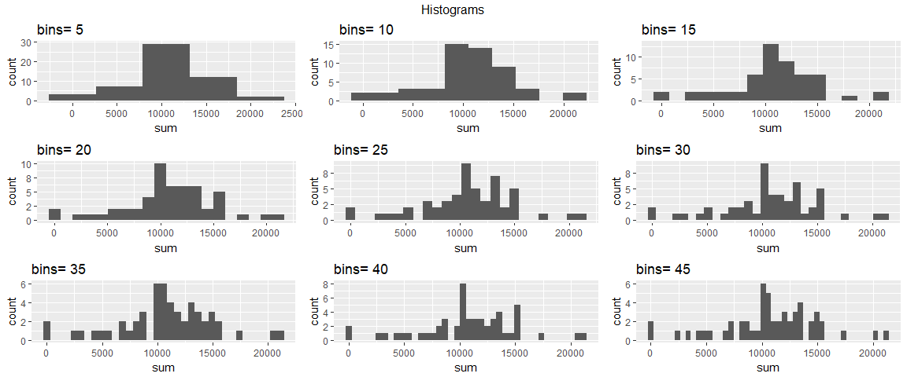
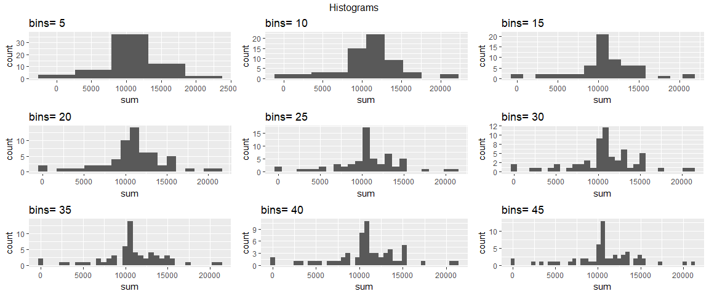

```r
knitr::opts_chunk$set(fig.width=12) 
knitr::opts_chunk$set(echo = TRUE)
```


## This is the setup of libraries and other options


```r
library(tidyverse)
```

```
## -- Attaching packages ----------------------------------------------------------------------------- tidyverse 1.2.1 --
```

```
## v ggplot2 2.2.1     v purrr   0.2.4
## v tibble  1.4.1     v dplyr   0.7.4
## v tidyr   0.7.2     v stringr 1.2.0
## v readr   1.1.1     v forcats 0.2.0
```

```
## -- Conflicts -------------------------------------------------------------------------------- tidyverse_conflicts() --
## x dplyr::filter() masks stats::filter()
## x dplyr::lag()    masks stats::lag()
```

```r
library(magrittr)
```

```
## 
## Attaching package: 'magrittr'
```

```
## The following object is masked from 'package:purrr':
## 
##     set_names
```

```
## The following object is masked from 'package:tidyr':
## 
##     extract
```

```r
library(lubridate)
```

```
## 
## Attaching package: 'lubridate'
```

```
## The following object is masked from 'package:base':
## 
##     date
```

```r
library(gridExtra)
```

```
## 
## Attaching package: 'gridExtra'
```

```
## The following object is masked from 'package:dplyr':
## 
##     combine
```

```r
library(mice)
```

```
## 
## Attaching package: 'mice'
```

```
## The following object is masked from 'package:tidyr':
## 
##     complete
```

```r
library(VIM)
```

```
## Loading required package: colorspace
```

```
## Loading required package: grid
```

```
## Loading required package: data.table
```

```
## 
## Attaching package: 'data.table'
```

```
## The following objects are masked from 'package:lubridate':
## 
##     hour, isoweek, mday, minute, month, quarter, second, wday,
##     week, yday, year
```

```
## The following objects are masked from 'package:dplyr':
## 
##     between, first, last
```

```
## The following object is masked from 'package:purrr':
## 
##     transpose
```

```
## VIM is ready to use. 
##  Since version 4.0.0 the GUI is in its own package VIMGUI.
## 
##           Please use the package to use the new (and old) GUI.
```

```
## Suggestions and bug-reports can be submitted at: https://github.com/alexkowa/VIM/issues
```

```
## 
## Attaching package: 'VIM'
```

```
## The following object is masked from 'package:datasets':
## 
##     sleep
```

```r
options(digits = 0, scipen = 999)
Sys.setenv(LANG = "en") ###didn't change language 
```

## FUNCTION_KABLE preparation (will be used later)


```r
library(knitr)
library(kableExtra)

FUNCTION_KABLE <- function (TABLE) {
    X <- deparse(substitute(TABLE))
kable (head(TABLE, 10), format = "html", row.names = T, align='c') %>% 
    kable_styling(bootstrap_options = c("striped", "hover", "condensed", "responsive"),
                  full_width = F, position = "center", font_size=13) %>%
    add_footnote (notation = "symbol", c(paste("TABLE:  ", X))) %>%
    column_spec(column=1, bold = F, border_left = F, width = "2cm") %>%
    column_spec(column=3, width = "3cm") %>%
    column_spec(column=ncol(TABLE)+1, bold=F, italic=F, color = "blue", width = "5cm")
    
}
```


#Loading and preprocessing the data
###################################


##Getting tha data


```r
file = "https://d396qusza40orc.cloudfront.net/repdata%2Fdata%2Factivity.zip"
download.file(file, destfile = "activity.zip")
cols <- c('steps' = "numeric",
         'date' = "character",
         'interval' = "integer")
activity <- read.csv(unzip ("activity.zip"), colClasses = cols)
str(activity)
```

```
## 'data.frame':	17568 obs. of  3 variables:
##  $ steps   : num  NA NA NA NA NA NA NA NA NA NA ...
##  $ date    : chr  "2012-10-01" "2012-10-01" "2012-10-01" "2012-10-01" ...
##  $ interval: int  0 5 10 15 20 25 30 35 40 45 ...
```


```r
FUNCTION_KABLE(activity)
```

<table class="table table-striped table-hover table-condensed table-responsive" style="font-size: 13px; width: auto !important; margin-left: auto; margin-right: auto;">
<thead><tr>
<th style="text-align:left;">   </th>
   <th style="text-align:center;"> steps </th>
   <th style="text-align:center;"> date </th>
   <th style="text-align:center;"> interval </th>
  </tr></thead>
<tbody>
<tr>
<td style="text-align:left;width: 2cm; "> 1 </td>
   <td style="text-align:center;"> NA </td>
   <td style="text-align:center;width: 3cm; "> 2012-10-01 </td>
   <td style="text-align:center;width: 5cm; color: blue;"> 0 </td>
  </tr>
<tr>
<td style="text-align:left;width: 2cm; "> 2 </td>
   <td style="text-align:center;"> NA </td>
   <td style="text-align:center;width: 3cm; "> 2012-10-01 </td>
   <td style="text-align:center;width: 5cm; color: blue;"> 5 </td>
  </tr>
<tr>
<td style="text-align:left;width: 2cm; "> 3 </td>
   <td style="text-align:center;"> NA </td>
   <td style="text-align:center;width: 3cm; "> 2012-10-01 </td>
   <td style="text-align:center;width: 5cm; color: blue;"> 10 </td>
  </tr>
<tr>
<td style="text-align:left;width: 2cm; "> 4 </td>
   <td style="text-align:center;"> NA </td>
   <td style="text-align:center;width: 3cm; "> 2012-10-01 </td>
   <td style="text-align:center;width: 5cm; color: blue;"> 15 </td>
  </tr>
<tr>
<td style="text-align:left;width: 2cm; "> 5 </td>
   <td style="text-align:center;"> NA </td>
   <td style="text-align:center;width: 3cm; "> 2012-10-01 </td>
   <td style="text-align:center;width: 5cm; color: blue;"> 20 </td>
  </tr>
<tr>
<td style="text-align:left;width: 2cm; "> 6 </td>
   <td style="text-align:center;"> NA </td>
   <td style="text-align:center;width: 3cm; "> 2012-10-01 </td>
   <td style="text-align:center;width: 5cm; color: blue;"> 25 </td>
  </tr>
<tr>
<td style="text-align:left;width: 2cm; "> 7 </td>
   <td style="text-align:center;"> NA </td>
   <td style="text-align:center;width: 3cm; "> 2012-10-01 </td>
   <td style="text-align:center;width: 5cm; color: blue;"> 30 </td>
  </tr>
<tr>
<td style="text-align:left;width: 2cm; "> 8 </td>
   <td style="text-align:center;"> NA </td>
   <td style="text-align:center;width: 3cm; "> 2012-10-01 </td>
   <td style="text-align:center;width: 5cm; color: blue;"> 35 </td>
  </tr>
<tr>
<td style="text-align:left;width: 2cm; "> 9 </td>
   <td style="text-align:center;"> NA </td>
   <td style="text-align:center;width: 3cm; "> 2012-10-01 </td>
   <td style="text-align:center;width: 5cm; color: blue;"> 40 </td>
  </tr>
<tr>
<td style="text-align:left;width: 2cm; "> 10 </td>
   <td style="text-align:center;"> NA </td>
   <td style="text-align:center;width: 3cm; "> 2012-10-01 </td>
   <td style="text-align:center;width: 5cm; color: blue;"> 45 </td>
  </tr>
</tbody>
<tfoot><tr>
<td style="padding: 0; border:0;" colspan="100%">
<sup>*</sup> TABLE:   activity</td>
</tr></tfoot>
</table>

##Preparing the data


```r
activity$time <- sprintf("%04d", activity$interval) %>%
    strptime("%H%M") %>%
    format("%H:%M")
activity$datetime <- paste(activity$date, activity$time, sep = " ") %>% as.POSIXct()
str(activity)
```

```
## 'data.frame':	17568 obs. of  5 variables:
##  $ steps   : num  NA NA NA NA NA NA NA NA NA NA ...
##  $ date    : chr  "2012-10-01" "2012-10-01" "2012-10-01" "2012-10-01" ...
##  $ interval: int  0 5 10 15 20 25 30 35 40 45 ...
##  $ time    : chr  "00:00" "00:05" "00:10" "00:15" ...
##  $ datetime: POSIXct, format: "2012-10-01 00:00:00" "2012-10-01 00:05:00" ...
```

```r
summary(activity)
```

```
##      steps          date              interval        time          
##  Min.   :  0    Length:17568       Min.   :   0   Length:17568      
##  1st Qu.:  0    Class :character   1st Qu.: 589   Class :character  
##  Median :  0    Mode  :character   Median :1178   Mode  :character  
##  Mean   : 37                       Mean   :1178                     
##  3rd Qu.: 12                       3rd Qu.:1766                     
##  Max.   :806                       Max.   :2355                     
##  NA's   :2304                                                       
##     datetime                  
##  Min.   :2012-10-01 00:00:00  
##  1st Qu.:2012-10-16 05:58:45  
##  Median :2012-10-31 11:57:30  
##  Mean   :2012-10-31 11:57:30  
##  3rd Qu.:2012-11-15 17:56:15  
##  Max.   :2012-11-30 23:55:00  
## 
```


```r
FUNCTION_KABLE(activity)
```

<table class="table table-striped table-hover table-condensed table-responsive" style="font-size: 13px; width: auto !important; margin-left: auto; margin-right: auto;">
<thead><tr>
<th style="text-align:left;">   </th>
   <th style="text-align:center;"> steps </th>
   <th style="text-align:center;"> date </th>
   <th style="text-align:center;"> interval </th>
   <th style="text-align:center;"> time </th>
   <th style="text-align:center;"> datetime </th>
  </tr></thead>
<tbody>
<tr>
<td style="text-align:left;width: 2cm; "> 1 </td>
   <td style="text-align:center;"> NA </td>
   <td style="text-align:center;width: 3cm; "> 2012-10-01 </td>
   <td style="text-align:center;"> 0 </td>
   <td style="text-align:center;"> 00:00 </td>
   <td style="text-align:center;width: 5cm; color: blue;"> 2012-10-01 00:00:00 </td>
  </tr>
<tr>
<td style="text-align:left;width: 2cm; "> 2 </td>
   <td style="text-align:center;"> NA </td>
   <td style="text-align:center;width: 3cm; "> 2012-10-01 </td>
   <td style="text-align:center;"> 5 </td>
   <td style="text-align:center;"> 00:05 </td>
   <td style="text-align:center;width: 5cm; color: blue;"> 2012-10-01 00:05:00 </td>
  </tr>
<tr>
<td style="text-align:left;width: 2cm; "> 3 </td>
   <td style="text-align:center;"> NA </td>
   <td style="text-align:center;width: 3cm; "> 2012-10-01 </td>
   <td style="text-align:center;"> 10 </td>
   <td style="text-align:center;"> 00:10 </td>
   <td style="text-align:center;width: 5cm; color: blue;"> 2012-10-01 00:10:00 </td>
  </tr>
<tr>
<td style="text-align:left;width: 2cm; "> 4 </td>
   <td style="text-align:center;"> NA </td>
   <td style="text-align:center;width: 3cm; "> 2012-10-01 </td>
   <td style="text-align:center;"> 15 </td>
   <td style="text-align:center;"> 00:15 </td>
   <td style="text-align:center;width: 5cm; color: blue;"> 2012-10-01 00:15:00 </td>
  </tr>
<tr>
<td style="text-align:left;width: 2cm; "> 5 </td>
   <td style="text-align:center;"> NA </td>
   <td style="text-align:center;width: 3cm; "> 2012-10-01 </td>
   <td style="text-align:center;"> 20 </td>
   <td style="text-align:center;"> 00:20 </td>
   <td style="text-align:center;width: 5cm; color: blue;"> 2012-10-01 00:20:00 </td>
  </tr>
<tr>
<td style="text-align:left;width: 2cm; "> 6 </td>
   <td style="text-align:center;"> NA </td>
   <td style="text-align:center;width: 3cm; "> 2012-10-01 </td>
   <td style="text-align:center;"> 25 </td>
   <td style="text-align:center;"> 00:25 </td>
   <td style="text-align:center;width: 5cm; color: blue;"> 2012-10-01 00:25:00 </td>
  </tr>
<tr>
<td style="text-align:left;width: 2cm; "> 7 </td>
   <td style="text-align:center;"> NA </td>
   <td style="text-align:center;width: 3cm; "> 2012-10-01 </td>
   <td style="text-align:center;"> 30 </td>
   <td style="text-align:center;"> 00:30 </td>
   <td style="text-align:center;width: 5cm; color: blue;"> 2012-10-01 00:30:00 </td>
  </tr>
<tr>
<td style="text-align:left;width: 2cm; "> 8 </td>
   <td style="text-align:center;"> NA </td>
   <td style="text-align:center;width: 3cm; "> 2012-10-01 </td>
   <td style="text-align:center;"> 35 </td>
   <td style="text-align:center;"> 00:35 </td>
   <td style="text-align:center;width: 5cm; color: blue;"> 2012-10-01 00:35:00 </td>
  </tr>
<tr>
<td style="text-align:left;width: 2cm; "> 9 </td>
   <td style="text-align:center;"> NA </td>
   <td style="text-align:center;width: 3cm; "> 2012-10-01 </td>
   <td style="text-align:center;"> 40 </td>
   <td style="text-align:center;"> 00:40 </td>
   <td style="text-align:center;width: 5cm; color: blue;"> 2012-10-01 00:40:00 </td>
  </tr>
<tr>
<td style="text-align:left;width: 2cm; "> 10 </td>
   <td style="text-align:center;"> NA </td>
   <td style="text-align:center;width: 3cm; "> 2012-10-01 </td>
   <td style="text-align:center;"> 45 </td>
   <td style="text-align:center;"> 00:45 </td>
   <td style="text-align:center;width: 5cm; color: blue;"> 2012-10-01 00:45:00 </td>
  </tr>
</tbody>
<tfoot><tr>
<td style="padding: 0; border:0;" colspan="100%">
<sup>*</sup> TABLE:   activity</td>
</tr></tfoot>
</table>
#What is mean total number of steps taken per day?
##################################################


## Study of steps per day (sum, mean & median)
### For this part of the assignment, you can ignore the missing values in the dataset


```r
activity_sum <- activity %>%
    .[complete.cases(.),] %>%
    aggregate(steps~date,., FUN=sum) %>%
    rename(sum=steps)
activity_sum$date %<>% as.Date()
str(activity_sum)
```

```
## 'data.frame':	53 obs. of  2 variables:
##  $ date: Date, format: "2012-10-02" "2012-10-03" ...
##  $ sum : num  126 11352 12116 13294 15420 ...
```


```r
FUNCTION_KABLE(activity_sum)
```

<table class="table table-striped table-hover table-condensed table-responsive" style="font-size: 13px; width: auto !important; margin-left: auto; margin-right: auto;">
<thead><tr>
<th style="text-align:left;">   </th>
   <th style="text-align:center;"> date </th>
   <th style="text-align:center;"> sum </th>
  </tr></thead>
<tbody>
<tr>
<td style="text-align:left;width: 2cm; "> 1 </td>
   <td style="text-align:center;"> 2012-10-02 </td>
   <td style="text-align:center;width: 3cm; width: 5cm; color: blue;"> 126 </td>
  </tr>
<tr>
<td style="text-align:left;width: 2cm; "> 2 </td>
   <td style="text-align:center;"> 2012-10-03 </td>
   <td style="text-align:center;width: 3cm; width: 5cm; color: blue;"> 11352 </td>
  </tr>
<tr>
<td style="text-align:left;width: 2cm; "> 3 </td>
   <td style="text-align:center;"> 2012-10-04 </td>
   <td style="text-align:center;width: 3cm; width: 5cm; color: blue;"> 12116 </td>
  </tr>
<tr>
<td style="text-align:left;width: 2cm; "> 4 </td>
   <td style="text-align:center;"> 2012-10-05 </td>
   <td style="text-align:center;width: 3cm; width: 5cm; color: blue;"> 13294 </td>
  </tr>
<tr>
<td style="text-align:left;width: 2cm; "> 5 </td>
   <td style="text-align:center;"> 2012-10-06 </td>
   <td style="text-align:center;width: 3cm; width: 5cm; color: blue;"> 15420 </td>
  </tr>
<tr>
<td style="text-align:left;width: 2cm; "> 6 </td>
   <td style="text-align:center;"> 2012-10-07 </td>
   <td style="text-align:center;width: 3cm; width: 5cm; color: blue;"> 11015 </td>
  </tr>
<tr>
<td style="text-align:left;width: 2cm; "> 7 </td>
   <td style="text-align:center;"> 2012-10-09 </td>
   <td style="text-align:center;width: 3cm; width: 5cm; color: blue;"> 12811 </td>
  </tr>
<tr>
<td style="text-align:left;width: 2cm; "> 8 </td>
   <td style="text-align:center;"> 2012-10-10 </td>
   <td style="text-align:center;width: 3cm; width: 5cm; color: blue;"> 9900 </td>
  </tr>
<tr>
<td style="text-align:left;width: 2cm; "> 9 </td>
   <td style="text-align:center;"> 2012-10-11 </td>
   <td style="text-align:center;width: 3cm; width: 5cm; color: blue;"> 10304 </td>
  </tr>
<tr>
<td style="text-align:left;width: 2cm; "> 10 </td>
   <td style="text-align:center;"> 2012-10-12 </td>
   <td style="text-align:center;width: 3cm; width: 5cm; color: blue;"> 17382 </td>
  </tr>
</tbody>
<tfoot><tr>
<td style="padding: 0; border:0;" colspan="100%">
<sup>*</sup> TABLE:   activity_sum</td>
</tr></tfoot>
</table>

### Histogram of the total number of steps taken each day


```r
plot_hist <- c()
for (i in 1:9) {
plot_hist[[i]] <- ggplot (activity_sum, aes(sum)) +
    geom_histogram(bins = i*5) +
    ggtitle(paste("bins=",i*5))
}
gridofplots <- grid.arrange(grobs=plot_hist, ncol=3, top="Histograms")
```

<!-- -->
### The mean

```r
mean_day <- mean(activity_sum$sum)
print(paste("Mean of of the total number of steps taken per day ", round(mean_day)))
```

```
## [1] "Mean of of the total number of steps taken per day  10766"
```

### The median

```r
median_day <- median (activity_sum$sum)
print(paste("Median of of the total number of steps taken per day ", round(median_day)))
```

```
## [1] "Median of of the total number of steps taken per day  10765"
```

### The distribution

```r
plot_final <- ggplot (activity_sum, aes(sum)) +
    geom_density(fill="grey") +
    ggtitle("Frequency of number of steps per day") +
    geom_vline(aes(xintercept=mean_day), color="red") +
    geom_vline(aes(xintercept=median_day), color="red")
plot_final
```

<!-- -->

#What is the average daily activity pattern?
############################################

## Study of number of steps by the 5mn interval


```r
activity_int <- activity %>%
    .[complete.cases(.),] %>%
    aggregate(steps~time,., FUN=mean) %>%
    rename(mean_steps=steps)

str(activity_int)
```

```
## 'data.frame':	288 obs. of  2 variables:
##  $ time      : chr  "00:00" "00:05" "00:10" "00:15" ...
##  $ mean_steps: num  1.717 0.3396 0.1321 0.1509 0.0755 ...
```


```r
FUNCTION_KABLE(activity_int)
```

<table class="table table-striped table-hover table-condensed table-responsive" style="font-size: 13px; width: auto !important; margin-left: auto; margin-right: auto;">
<thead><tr>
<th style="text-align:left;">   </th>
   <th style="text-align:center;"> time </th>
   <th style="text-align:center;"> mean_steps </th>
  </tr></thead>
<tbody>
<tr>
<td style="text-align:left;width: 2cm; "> 1 </td>
   <td style="text-align:center;"> 00:00 </td>
   <td style="text-align:center;width: 3cm; width: 5cm; color: blue;"> 2 </td>
  </tr>
<tr>
<td style="text-align:left;width: 2cm; "> 2 </td>
   <td style="text-align:center;"> 00:05 </td>
   <td style="text-align:center;width: 3cm; width: 5cm; color: blue;"> 0 </td>
  </tr>
<tr>
<td style="text-align:left;width: 2cm; "> 3 </td>
   <td style="text-align:center;"> 00:10 </td>
   <td style="text-align:center;width: 3cm; width: 5cm; color: blue;"> 0 </td>
  </tr>
<tr>
<td style="text-align:left;width: 2cm; "> 4 </td>
   <td style="text-align:center;"> 00:15 </td>
   <td style="text-align:center;width: 3cm; width: 5cm; color: blue;"> 0 </td>
  </tr>
<tr>
<td style="text-align:left;width: 2cm; "> 5 </td>
   <td style="text-align:center;"> 00:20 </td>
   <td style="text-align:center;width: 3cm; width: 5cm; color: blue;"> 0 </td>
  </tr>
<tr>
<td style="text-align:left;width: 2cm; "> 6 </td>
   <td style="text-align:center;"> 00:25 </td>
   <td style="text-align:center;width: 3cm; width: 5cm; color: blue;"> 2 </td>
  </tr>
<tr>
<td style="text-align:left;width: 2cm; "> 7 </td>
   <td style="text-align:center;"> 00:30 </td>
   <td style="text-align:center;width: 3cm; width: 5cm; color: blue;"> 1 </td>
  </tr>
<tr>
<td style="text-align:left;width: 2cm; "> 8 </td>
   <td style="text-align:center;"> 00:35 </td>
   <td style="text-align:center;width: 3cm; width: 5cm; color: blue;"> 1 </td>
  </tr>
<tr>
<td style="text-align:left;width: 2cm; "> 9 </td>
   <td style="text-align:center;"> 00:40 </td>
   <td style="text-align:center;width: 3cm; width: 5cm; color: blue;"> 0 </td>
  </tr>
<tr>
<td style="text-align:left;width: 2cm; "> 10 </td>
   <td style="text-align:center;"> 00:45 </td>
   <td style="text-align:center;width: 3cm; width: 5cm; color: blue;"> 1 </td>
  </tr>
</tbody>
<tfoot><tr>
<td style="padding: 0; border:0;" colspan="100%">
<sup>*</sup> TABLE:   activity_int</td>
</tr></tfoot>
</table>


```r
breaks <- activity_int$time %>% substr(1,2) %>% unique() %>% paste(":00",sep="")

ggplot (data = activity_int, aes(x=time, y=mean_steps, group=1)) +
    geom_line() + 
    scale_x_discrete(name="intervals", breaks=breaks) +
    theme(axis.text.x = element_text(angle = 90, hjust = 1))
```

<!-- -->
## max of mean_steps time


```r
subset (activity_int, mean_steps==max(mean_steps), select=time)
```

```
##      time
## 104 08:35
```
#Imputing missing values
########################

## NA's detection


```r
activity_miss = aggr(activity, col=mdc(1:2),
                   numbers=TRUE, sortVars=TRUE,
                   labels=names(activity),
                   cex.axis=.7,
                   gap=3,
                   ylab=c("Proportion of missingness","Missingness Pattern"))
```

<!-- -->

```
## 
##  Variables sorted by number of missings: 
##  Variable Count
##     steps     0
##      date     0
##  interval     0
##      time     0
##  datetime     0
```


```r
table(is.na(activity$steps))
```

```
## 
## FALSE  TRUE 
## 15264  2304
```

####13% of col steps are missing (2304/17568)

## NA's imputation


```r
activity_new <- merge(activity, activity_int, by="time")
activity_new$steps_new <- ifelse(test = (is.na(activity_new$steps)),
                                 activity_new$mean_steps,
                                 activity_new$steps)
activity_new <- select(activity_new, date, interval, steps_new) %>% arrange(date)
sum(is.na(activity_new))
```

```
## [1] 0
```

```r
str(activity_new)
```

```
## 'data.frame':	17568 obs. of  3 variables:
##  $ date     : chr  "2012-10-01" "2012-10-01" "2012-10-01" "2012-10-01" ...
##  $ interval : int  0 5 10 15 20 25 30 35 40 45 ...
##  $ steps_new: num  1.717 0.3396 0.1321 0.1509 0.0755 ...
```

```r
summary(activity_new)
```

```
##      date              interval      steps_new  
##  Length:17568       Min.   :   0   Min.   :  0  
##  Class :character   1st Qu.: 589   1st Qu.:  0  
##  Mode  :character   Median :1178   Median :  0  
##                     Mean   :1178   Mean   : 37  
##                     3rd Qu.:1766   3rd Qu.: 27  
##                     Max.   :2355   Max.   :806
```


```r
FUNCTION_KABLE(activity_new)
```

<table class="table table-striped table-hover table-condensed table-responsive" style="font-size: 13px; width: auto !important; margin-left: auto; margin-right: auto;">
<thead><tr>
<th style="text-align:left;">   </th>
   <th style="text-align:center;"> date </th>
   <th style="text-align:center;"> interval </th>
   <th style="text-align:center;"> steps_new </th>
  </tr></thead>
<tbody>
<tr>
<td style="text-align:left;width: 2cm; "> 1 </td>
   <td style="text-align:center;"> 2012-10-01 </td>
   <td style="text-align:center;width: 3cm; "> 0 </td>
   <td style="text-align:center;width: 5cm; color: blue;"> 2 </td>
  </tr>
<tr>
<td style="text-align:left;width: 2cm; "> 2 </td>
   <td style="text-align:center;"> 2012-10-01 </td>
   <td style="text-align:center;width: 3cm; "> 5 </td>
   <td style="text-align:center;width: 5cm; color: blue;"> 0 </td>
  </tr>
<tr>
<td style="text-align:left;width: 2cm; "> 3 </td>
   <td style="text-align:center;"> 2012-10-01 </td>
   <td style="text-align:center;width: 3cm; "> 10 </td>
   <td style="text-align:center;width: 5cm; color: blue;"> 0 </td>
  </tr>
<tr>
<td style="text-align:left;width: 2cm; "> 4 </td>
   <td style="text-align:center;"> 2012-10-01 </td>
   <td style="text-align:center;width: 3cm; "> 15 </td>
   <td style="text-align:center;width: 5cm; color: blue;"> 0 </td>
  </tr>
<tr>
<td style="text-align:left;width: 2cm; "> 5 </td>
   <td style="text-align:center;"> 2012-10-01 </td>
   <td style="text-align:center;width: 3cm; "> 20 </td>
   <td style="text-align:center;width: 5cm; color: blue;"> 0 </td>
  </tr>
<tr>
<td style="text-align:left;width: 2cm; "> 6 </td>
   <td style="text-align:center;"> 2012-10-01 </td>
   <td style="text-align:center;width: 3cm; "> 25 </td>
   <td style="text-align:center;width: 5cm; color: blue;"> 2 </td>
  </tr>
<tr>
<td style="text-align:left;width: 2cm; "> 7 </td>
   <td style="text-align:center;"> 2012-10-01 </td>
   <td style="text-align:center;width: 3cm; "> 30 </td>
   <td style="text-align:center;width: 5cm; color: blue;"> 1 </td>
  </tr>
<tr>
<td style="text-align:left;width: 2cm; "> 8 </td>
   <td style="text-align:center;"> 2012-10-01 </td>
   <td style="text-align:center;width: 3cm; "> 35 </td>
   <td style="text-align:center;width: 5cm; color: blue;"> 1 </td>
  </tr>
<tr>
<td style="text-align:left;width: 2cm; "> 9 </td>
   <td style="text-align:center;"> 2012-10-01 </td>
   <td style="text-align:center;width: 3cm; "> 40 </td>
   <td style="text-align:center;width: 5cm; color: blue;"> 0 </td>
  </tr>
<tr>
<td style="text-align:left;width: 2cm; "> 10 </td>
   <td style="text-align:center;"> 2012-10-01 </td>
   <td style="text-align:center;width: 3cm; "> 45 </td>
   <td style="text-align:center;width: 5cm; color: blue;"> 1 </td>
  </tr>
</tbody>
<tfoot><tr>
<td style="padding: 0; border:0;" colspan="100%">
<sup>*</sup> TABLE:   activity_new</td>
</tr></tfoot>
</table>
### Repeat activity_sum with the new dataset activity_new


```r
activity_sum_new <- activity_new %>%
    .[complete.cases(.),] %>%
    aggregate(steps_new~date,., FUN=sum) %>%
    rename(sum=steps_new)
activity_sum_new$date %<>% as.Date()
str(activity_sum_new)
```

```
## 'data.frame':	61 obs. of  2 variables:
##  $ date: Date, format: "2012-10-01" "2012-10-02" ...
##  $ sum : num  10766 126 11352 12116 13294 ...
```
 
### Histogram of the total number of steps taken each day on activity_new
 

```r
plot_hist_new <- c()
for (i in 1:9) {
    plot_hist_new[[i]] <- ggplot (activity_sum_new, aes(sum)) +
        geom_histogram(bins = i*5) +
        ggtitle(paste("bins=",i*5))
}

gridofplots <- grid.arrange(grobs=plot_hist_new, ncol=3, top="Histograms")
```

<!-- -->

### The mean


```r
mean_day <- mean(activity_sum_new$sum)
print(paste("Mean of of the total number of steps taken per day ", round(mean_day)))
```

```
## [1] "Mean of of the total number of steps taken per day  10766"
```
No difference

### The median


```r
median_day <- median (activity_sum_new$sum)
print(paste("Median of of the total number of steps taken per day ", round(median_day)))
```

```
## [1] "Median of of the total number of steps taken per day  10766"
```
No significant difference

### The distribution and the evolution after imputation


```r
plot_final_new <- ggplot (activity_sum_new, aes(sum)) +
    geom_density(fill="grey") +
    ggtitle("Frequency of number of steps per day") +
    geom_vline(aes(xintercept=mean_day), color="red") +
    geom_vline(aes(xintercept=median_day), color="red")
gridofplots <- grid.arrange(plot_final,plot_final_new, ncol=2, top="Difference")
```

<!-- -->


```r
gridofplots <- grid.arrange(plot_hist[[2]],plot_hist_new[[2]], ncol=2, top="Difference")
```

<!-- -->

#Are there differences in activity patterns between weekdays and weekends?
##########################################################################


## Preparing the data


```r
activity_new$time <- sprintf("%04d", activity_new$interval) %>%
    strptime("%H%M") %>%
    format("%H:%M")
activity_new$datetime <- paste(activity_new$date, activity_new$time, sep = " ") %>% as.POSIXct()
activity_new$weekday <- weekdays(activity_new$datetime)
activity_new$type_of_day <- ifelse(test = activity_new$weekday %in% c("samedi", "dimanche"),
                                   yes = "weekend",
                                   no = "weekday" ) %>% as.factor()

str(activity_new)
```

```
## 'data.frame':	17568 obs. of  7 variables:
##  $ date       : chr  "2012-10-01" "2012-10-01" "2012-10-01" "2012-10-01" ...
##  $ interval   : int  0 5 10 15 20 25 30 35 40 45 ...
##  $ steps_new  : num  1.717 0.3396 0.1321 0.1509 0.0755 ...
##  $ time       : chr  "00:00" "00:05" "00:10" "00:15" ...
##  $ datetime   : POSIXct, format: "2012-10-01 00:00:00" "2012-10-01 00:05:00" ...
##  $ weekday    : chr  "lundi" "lundi" "lundi" "lundi" ...
##  $ type_of_day: Factor w/ 2 levels "weekday","weekend": 1 1 1 1 1 1 1 1 1 1 ...
```

```r
summary(activity_new)
```

```
##      date              interval      steps_new       time          
##  Length:17568       Min.   :   0   Min.   :  0   Length:17568      
##  Class :character   1st Qu.: 589   1st Qu.:  0   Class :character  
##  Mode  :character   Median :1178   Median :  0   Mode  :character  
##                     Mean   :1178   Mean   : 37                     
##                     3rd Qu.:1766   3rd Qu.: 27                     
##                     Max.   :2355   Max.   :806                     
##     datetime                     weekday           type_of_day   
##  Min.   :2012-10-01 00:00:00   Length:17568       weekday:12960  
##  1st Qu.:2012-10-16 05:58:45   Class :character   weekend: 4608  
##  Median :2012-10-31 11:57:30   Mode  :character                  
##  Mean   :2012-10-31 11:57:30                                     
##  3rd Qu.:2012-11-15 17:56:15                                     
##  Max.   :2012-11-30 23:55:00
```


```r
FUNCTION_KABLE(activity_new)
```

<table class="table table-striped table-hover table-condensed table-responsive" style="font-size: 13px; width: auto !important; margin-left: auto; margin-right: auto;">
<thead><tr>
<th style="text-align:left;">   </th>
   <th style="text-align:center;"> date </th>
   <th style="text-align:center;"> interval </th>
   <th style="text-align:center;"> steps_new </th>
   <th style="text-align:center;"> time </th>
   <th style="text-align:center;"> datetime </th>
   <th style="text-align:center;"> weekday </th>
   <th style="text-align:center;"> type_of_day </th>
  </tr></thead>
<tbody>
<tr>
<td style="text-align:left;width: 2cm; "> 1 </td>
   <td style="text-align:center;"> 2012-10-01 </td>
   <td style="text-align:center;width: 3cm; "> 0 </td>
   <td style="text-align:center;"> 2 </td>
   <td style="text-align:center;"> 00:00 </td>
   <td style="text-align:center;"> 2012-10-01 00:00:00 </td>
   <td style="text-align:center;"> lundi </td>
   <td style="text-align:center;width: 5cm; color: blue;"> weekday </td>
  </tr>
<tr>
<td style="text-align:left;width: 2cm; "> 2 </td>
   <td style="text-align:center;"> 2012-10-01 </td>
   <td style="text-align:center;width: 3cm; "> 5 </td>
   <td style="text-align:center;"> 0 </td>
   <td style="text-align:center;"> 00:05 </td>
   <td style="text-align:center;"> 2012-10-01 00:05:00 </td>
   <td style="text-align:center;"> lundi </td>
   <td style="text-align:center;width: 5cm; color: blue;"> weekday </td>
  </tr>
<tr>
<td style="text-align:left;width: 2cm; "> 3 </td>
   <td style="text-align:center;"> 2012-10-01 </td>
   <td style="text-align:center;width: 3cm; "> 10 </td>
   <td style="text-align:center;"> 0 </td>
   <td style="text-align:center;"> 00:10 </td>
   <td style="text-align:center;"> 2012-10-01 00:10:00 </td>
   <td style="text-align:center;"> lundi </td>
   <td style="text-align:center;width: 5cm; color: blue;"> weekday </td>
  </tr>
<tr>
<td style="text-align:left;width: 2cm; "> 4 </td>
   <td style="text-align:center;"> 2012-10-01 </td>
   <td style="text-align:center;width: 3cm; "> 15 </td>
   <td style="text-align:center;"> 0 </td>
   <td style="text-align:center;"> 00:15 </td>
   <td style="text-align:center;"> 2012-10-01 00:15:00 </td>
   <td style="text-align:center;"> lundi </td>
   <td style="text-align:center;width: 5cm; color: blue;"> weekday </td>
  </tr>
<tr>
<td style="text-align:left;width: 2cm; "> 5 </td>
   <td style="text-align:center;"> 2012-10-01 </td>
   <td style="text-align:center;width: 3cm; "> 20 </td>
   <td style="text-align:center;"> 0 </td>
   <td style="text-align:center;"> 00:20 </td>
   <td style="text-align:center;"> 2012-10-01 00:20:00 </td>
   <td style="text-align:center;"> lundi </td>
   <td style="text-align:center;width: 5cm; color: blue;"> weekday </td>
  </tr>
<tr>
<td style="text-align:left;width: 2cm; "> 6 </td>
   <td style="text-align:center;"> 2012-10-01 </td>
   <td style="text-align:center;width: 3cm; "> 25 </td>
   <td style="text-align:center;"> 2 </td>
   <td style="text-align:center;"> 00:25 </td>
   <td style="text-align:center;"> 2012-10-01 00:25:00 </td>
   <td style="text-align:center;"> lundi </td>
   <td style="text-align:center;width: 5cm; color: blue;"> weekday </td>
  </tr>
<tr>
<td style="text-align:left;width: 2cm; "> 7 </td>
   <td style="text-align:center;"> 2012-10-01 </td>
   <td style="text-align:center;width: 3cm; "> 30 </td>
   <td style="text-align:center;"> 1 </td>
   <td style="text-align:center;"> 00:30 </td>
   <td style="text-align:center;"> 2012-10-01 00:30:00 </td>
   <td style="text-align:center;"> lundi </td>
   <td style="text-align:center;width: 5cm; color: blue;"> weekday </td>
  </tr>
<tr>
<td style="text-align:left;width: 2cm; "> 8 </td>
   <td style="text-align:center;"> 2012-10-01 </td>
   <td style="text-align:center;width: 3cm; "> 35 </td>
   <td style="text-align:center;"> 1 </td>
   <td style="text-align:center;"> 00:35 </td>
   <td style="text-align:center;"> 2012-10-01 00:35:00 </td>
   <td style="text-align:center;"> lundi </td>
   <td style="text-align:center;width: 5cm; color: blue;"> weekday </td>
  </tr>
<tr>
<td style="text-align:left;width: 2cm; "> 9 </td>
   <td style="text-align:center;"> 2012-10-01 </td>
   <td style="text-align:center;width: 3cm; "> 40 </td>
   <td style="text-align:center;"> 0 </td>
   <td style="text-align:center;"> 00:40 </td>
   <td style="text-align:center;"> 2012-10-01 00:40:00 </td>
   <td style="text-align:center;"> lundi </td>
   <td style="text-align:center;width: 5cm; color: blue;"> weekday </td>
  </tr>
<tr>
<td style="text-align:left;width: 2cm; "> 10 </td>
   <td style="text-align:center;"> 2012-10-01 </td>
   <td style="text-align:center;width: 3cm; "> 45 </td>
   <td style="text-align:center;"> 1 </td>
   <td style="text-align:center;"> 00:45 </td>
   <td style="text-align:center;"> 2012-10-01 00:45:00 </td>
   <td style="text-align:center;"> lundi </td>
   <td style="text-align:center;width: 5cm; color: blue;"> weekday </td>
  </tr>
</tbody>
<tfoot><tr>
<td style="padding: 0; border:0;" colspan="100%">
<sup>*</sup> TABLE:   activity_new</td>
</tr></tfoot>
</table>

## Study of number of steps by the 5mn interval


```r
activity_int <- activity_new %>%
    aggregate(steps_new~time+type_of_day,., FUN=mean) %>%
    rename(mean_steps=steps_new)

str(activity_int)
```

```
## 'data.frame':	576 obs. of  3 variables:
##  $ time       : chr  "00:00" "00:05" "00:10" "00:15" ...
##  $ type_of_day: Factor w/ 2 levels "weekday","weekend": 1 1 1 1 1 1 1 1 1 1 ...
##  $ mean_steps : num  2.251 0.445 0.173 0.198 0.099 ...
```


```r
breaks <- activity_int$time %>% substr(1,2) %>% unique() %>% paste(":00",sep="")

ggplot (data = activity_int, aes(x=time, y=mean_steps, group=1)) +
    geom_line() + 
    scale_x_discrete(name="intervals", breaks=breaks) +
    theme(axis.text.x = element_text(angle = 90, hjust = 1)) +
    facet_grid(type_of_day~.)
```

<!-- -->


